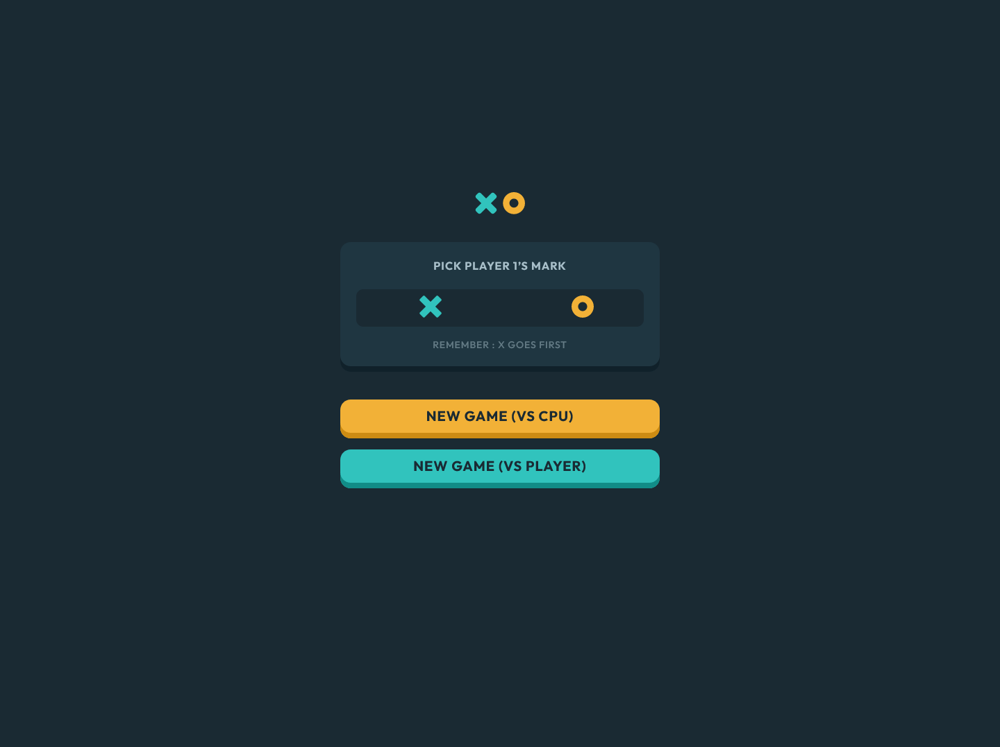
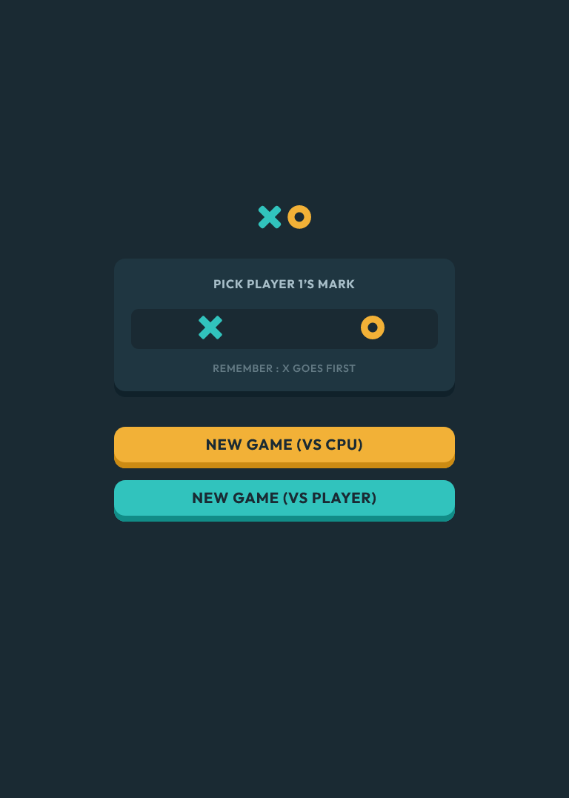

## Table of contents

- [Overview](#overview)
  - [The challenge](#the-challenge)
  - [Screenshot](#screenshot)
  - [Links](#links)
- [My process](#my-process)
  - [Built with](#built-with)
  - [What I learned](#what-i-learned)
  - [Continued development](#continued-development)
  - [Useful resources](#useful-resources)
- [Author](#author)
- [Acknowledgments](#acknowledgments)

## Overview

In this project I mainly needed to focus on page layout,page responsiveness and game functionality..

### The challenge

Users should be able to:

- View the optimal layout for each page depending on their device's screen size
- See hover states for all interactive elements throughout the site
- Input X or O
- Choose Player 1 role
- Play Player vs Player
- Play Player vs CPU

### Screenshot

### Links

- Solution URL: [GitHub Code](https://github.com/Tusho7/Tic-Tac-Toe)
- Live Site URL: [GitHub Live](https://tusho7.github.io/Tic-Tac-Toe/)

## My process

Create Header
Add logo
Create divs
Add texts
Add inputs of X and O
Add winner result section
Add Javascript code to give calculator functionalities, of input, count, output responsivelly
Give styles in CSS
Add hover effects in CSS

### Built with

- Semantic HTML5 markup
- CSS custom properties
- Mobile first approach
- Flexbox
- CSS Grid
- Media Queries
- Vanilla Javascript

### What I learned

While working on this project, I gained more practise of using Media Queries & Javascript,  the main challenge that I overcame was to create Js Functionality for the game.After research and practicing different ways for resolving this step, I wrote the Javascript code which worked eventually, Javascripts code calculates winning ways and tries CPU to win on Player. On the other hand Player vs Player is created to work without problems and any kind of bugs. 

### Continued development

I want to create other projects like this to finally master coding and make more dynamic, interactive and functional projects

## Author

- GitHub - [Sandro Tushurashvili](https://github.com/Tusho7)
- LinkedIn - [Sandro Tushurashvili](https://www.linkedin.com/in/sandro-tushurashvili/)